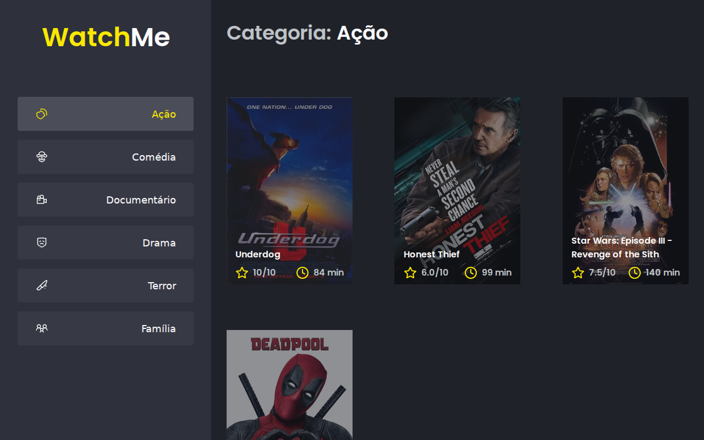

# Desafio 02 - Ignite

> This project used to live together with several other study projects in a single monorepo. It has since been split out into its own dedicated repository. See the original [estudos-ignite](https://github.com/vinicastroo/estudos-ignite) repo for more context.



Study challenge/exercise from the React.js module of Ignite (Rocketseat), 2021 class. It is a movie explorer organized by genre: a sidebar lists the genres (action, comedy, documentary, drama, horror, family) and, upon selecting one, the content area displays the corresponding movies consumed from a fake API.

## Technologies

- React
- TypeScript
- webpack
- axios
- json-server (fake API)
- react-feather / react-icons

## How to run

```bash
yarn install
yarn server
```

In another terminal:

```bash
yarn dev
```

## Related repositories

Part of the React.js module of Ignite (Rocketseat), 2021 class:

- [DTMoney-Ignite](https://github.com/vinicastroo/DTMoney-Ignite)
- [Desafio01-Ignite](https://github.com/vinicastroo/Desafio01-Ignite)
- [Desafio02-Ignite](https://github.com/vinicastroo/Desafio02-Ignite) (this repo)
- [Desafio03-Ignite](https://github.com/vinicastroo/Desafio03-Ignite)
- [Desafio04-Ignite](https://github.com/vinicastroo/Desafio04-Ignite)
- [GithubExplorer-Ignite](https://github.com/vinicastroo/GithubExplorer-Ignite)
- [ignews](https://github.com/vinicastroo/ignews)
